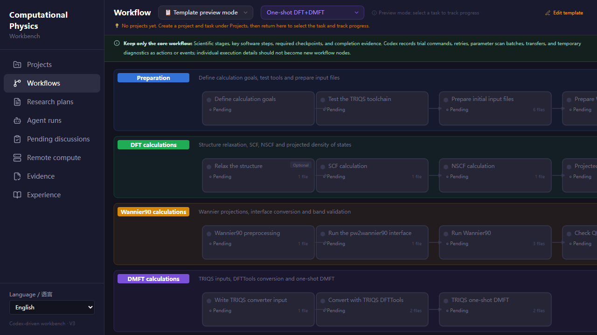
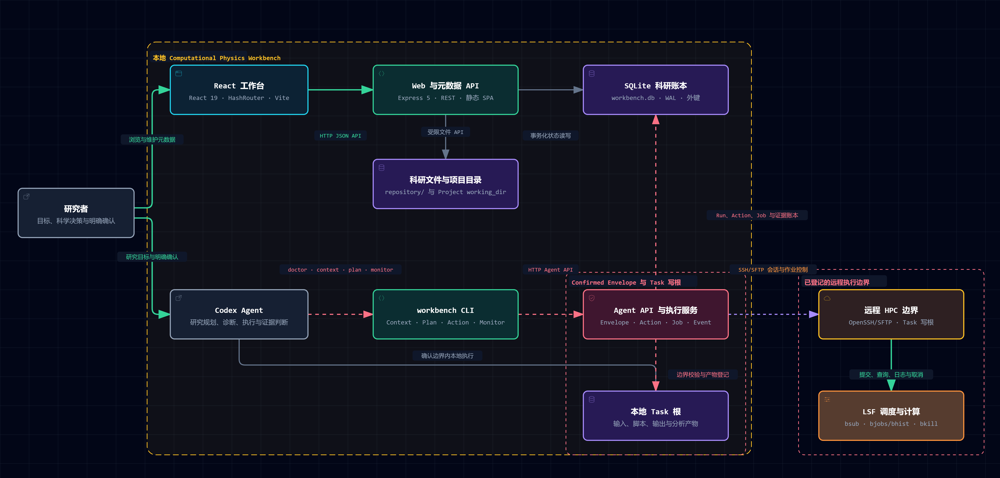
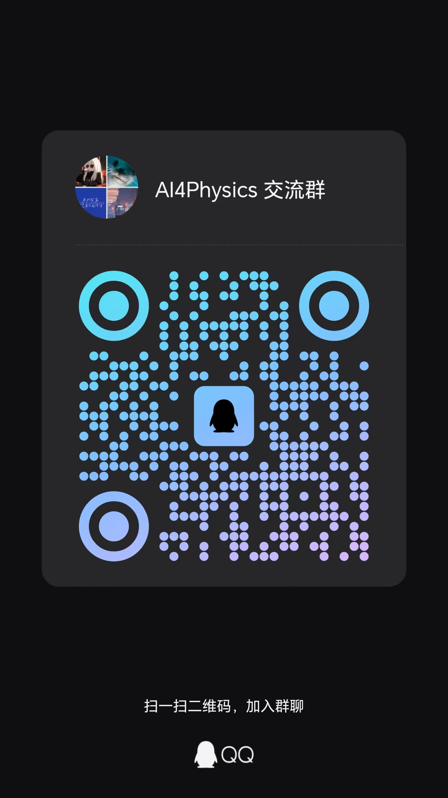

# Computational Physics Workbench

[](https://doi.org/10.5281/zenodo.22652970)

English | [简体中文](README.md)

> An agent-operated, human-reviewed research workbench for computational and theoretical physics.

Computational Physics Workbench is a local-first research collaboration system. A researcher defines the scientific objective, confirms the execution boundary, and reviews decisive evidence. A Codex agent plans and executes the work, diagnoses failures, monitors remote jobs, and maintains a traceable research record.

DFT+DMFT is the first and currently most complete use case, not the boundary of the system. The core is intended for broader computational and theoretical physics workflows.

Designed for AI for Science and scientific computing, it brings editable research workflows, HPC jobs, evidence provenance, and human–agent execution boundaries into one local-first system for DFT, DMFT, many-body computation, numerical simulation, and theoretical derivation.

> **Status:** This is an early research preview. Interfaces and data models may change. We welcome physicists, research-software engineers, HPC users, and scientific-agent researchers who want to shape the system through concrete workflows and evidence.

## Interface preview



The workflow view presents selectable and editable structures for computational and theoretical physics research. The web application is a review surface; research execution is driven by the Codex agent.

## Supported reference path

This public preview provides one complete reference path:

- Agent client: Codex
- Remote transport: OpenSSH/SFTP
- HPC scheduler: IBM LSF

Slurm, PBS, Claude Code, WorkBuddy, and DeepSeek Harness are planned adapter targets and are not officially supported yet. The CLI, HTTP API, execution boundaries, and research ledger are designed as a portable core, while client skills, hooks, long-job wake-ups, and scheduler commands still require host-specific adapters. To prevent accidental submission through the wrong scheduler, this version rejects non-LSF scheduler configurations.

## Agent skills

The repository provides three complementary skills under the project-local [`skills/`](skills) directory and treats these files as the single versions distributed with the source code and on GitHub. `AGENTS.md` routes real Workbench tasks to the corresponding project skill, so `workbench-agent` does not need to be copied into personal configuration:

- [`workbench-agent`](skills/workbench-agent/SKILL.md) handles recovery, boundary confirmation, execution, HPC monitoring, evidence, and experience for real Workbench tasks.
- [`literature-research`](skills/literature-research/SKILL.md) performs systematic literature mapping, claim-level evidence matrices, closest-prior-work comparison, and novelty audits.
- [`theory-derivation`](skills/theory-derivation/SKILL.md) supports transparent derivations and independent symbolic, group-theoretic, operator, or numerical checks.

The first skill is the Workbench execution protocol. The other two provide scientific capabilities invoked by the built-in theoretical-research and physics-literature-reproduction workflows. They discover the current host's tools instead of assuming the author's private paths or licensed software.

## Why this project exists

Most research software leaves the researcher to coordinate scripts, interfaces, HPC sessions, intermediate results, and scientific decisions manually. This project makes the researcher-agent conversation the center of that collaboration:

- **The researcher owns commitments and judgment:** objectives, physical assumptions, resource boundaries, review gates, and conclusions.
- **The agent owns execution and closure:** working plans, local and remote operations, job monitoring, failure diagnosis, and evidence collection.
- **The workbench owns boundaries and memory:** filesystem and permission constraints plus a traceable ledger of runs, actions, jobs, artifacts, evidence, and reusable experience.
- **The web application supports review:** it shows recorded state but is not a hidden agent or remote execution surface.



Read the [English architecture guide](docs/ARCHITECTURE.en.md) for the system model. The architecture image above and the [interactive architecture diagram](doc/computational-physics-workbench-architecture.html) currently use Chinese labels.

## Current capabilities

- Project, task, and editable scientific workflow management
- DFT+DMFT, model-DMFT, general theoretical-research, and physics-literature-reproduction workflow templates
- A confirmed Task Spec plus an agent-maintained Working Plan
- Append-only Run → Action → Job → Artifact/Evidence provenance
- Research notes, reflection loops, evidence indexing, and reusable experience
- Bounded OpenSSH/SFTP and LSF operations with uncertain-submission reconciliation
- Agent-selected long-job monitoring through Codex scheduled heartbeats
- A read-only review surface for agent activity, jobs, evidence, and pending researcher decisions

## Quick start

Requirements: Node.js 22.12+ and npm. Use a source checkout and run commands from its root.

```shell
npm ci
npm run dev:full
```

Open the URL printed by Vite (by default <http://127.0.0.1:5173>). For a production-style local build:

```shell
npm run build
npm start
```

Then open <http://127.0.0.1:3001>. The unchanged origin policy allows only the two development origins on port 5173 by default. Browser writes from the built page require an explicit allowed origin; use the [disposable local preview](docs/examples/local-first-run.en.md) for an exact, process-local loopback configuration. This language upgrade does not alter production access policy.

Select English or 简体中文 in the sidebar. Your choice is saved in this browser; otherwise the browser language is used with English fallback. Language changes preserve researcher-authored notes, identifiers, scientific data and recorded provenance.

The CLI needs no global installation. In another terminal while the service is running:

```shell
node bin/workbench.js --help
node bin/workbench.js doctor --lang en --pretty
```

Use `--lang zh-CN` for Chinese generated service prose, or set `WORKBENCH_LANG`. CLI help and many technical errors remain English. See [configuration](docs/REMOTE_COMPUTE.en.md#local-service-configuration) for a custom service URL, database or browser origin. Try the [local-only example](docs/examples/local-first-run.en.md) with a disposable database before using real research data.

The SQLite runtime database, real research inputs and outputs, credentials, and local environment files are intentionally excluded from Git.

## User documentation

- [First use: from a project to a controlled Research Run](docs/GETTING_STARTED.en.md)
- [Usage guide: planning layers, execution ledger, workflow design, and long-running research](docs/USAGE_GUIDE.en.md)
- [Remote compute: connection, transfer, and agent collaboration](docs/REMOTE_COMPUTE.en.md)
- [Task and Run model](docs/TASKS.en.md), [architecture](docs/ARCHITECTURE.en.md), and [testing](TESTING.en.md)
- [English agent project guide](AGENTS.en.md) and [local-only runnable example](docs/examples/local-first-run.en.md)
- [API reference](doc/API_REFERENCE.en.md) and [current schema data dictionary](doc/DATA_DICTIONARY.en.md)
- [Physics paper reproduction workflow](doc/PAPER_REPRODUCTION_WORKFLOW.en.md), [design decisions](docs/DECISIONS.en.md), and [roadmap](ROADMAP.en.md)

Each guide and current technical reference links to its Chinese counterpart. They clarify the distinction between Codex projects/chats and Workbench Projects/Tasks. Full Codex transcripts are not committed to this repository by default. Historical design plans and old release notes remain in their original language; the current API, schema, design decisions, roadmap and paper-reproduction guidance have English counterparts checked against the implementation.

## Important limitations

- This is not yet a packaged end-user application; installation currently assumes a source checkout and Node.js.
- Remote execution currently targets OpenSSH/SFTP and LSF environments.
- Built-in physics workflows are starting structures, not universal scientific protocols. Users remain responsible for method choice, parameters, convergence, uncertainty, and interpretation.
- The project does not replace citations for the physical methods, solvers, or upstream scientific software used in a study.

## Community

Join the **AI4Physics QQ group** to discuss AI for Science, computational and theoretical physics, scientific agents, HPC workflows, and open-source contributions.

<p align="center">
  
</p>

The group is not an official support channel. Do not share passwords, private keys, complete HPC login details, or unpublished research data. Reproducible bugs and feature proposals should still be filed as GitHub Issues.

## Contributing

Focused contributions are welcome, especially for new physics workflows, reproducibility, evidence evaluation, HPC portability, agent safety, installation, documentation, and tests. Please read [CONTRIBUTING.md](CONTRIBUTING.md) before opening a pull request.

This is an early-stage volunteer project with no guaranteed response time. Small, coherent contributions with reproducible evidence are the easiest to review.

See the [roadmap](ROADMAP.en.md) for current priorities: reliable long-running research, scientific claims and memory, scheduler and agent adapters, file-based workflow cards, and deeper theoretical and many-body capabilities.

## Citation

If the workbench contributes to research planning, execution, evidence management, or reproducibility, cite the software version in addition to the physical methods and scientific software used. Citation metadata is available in [CITATION.cff](CITATION.cff).

> Yan, Shuai. (2026). Computational Physics Workbench (Version 0.2.0) [Computer software]. Zenodo. https://doi.org/10.5281/zenodo.22653039

Use the [version DOI](https://doi.org/10.5281/zenodo.22653039) to cite this exact release. The [concept DOI](https://doi.org/10.5281/zenodo.22652970) always resolves to the complete version series.

## Security and license

Do not include credentials, private HPC information, unpublished data, or local databases in issues or test fixtures. Report vulnerabilities according to [SECURITY.md](SECURITY.md).

Computational Physics Workbench is licensed under the [Apache License 2.0](LICENSE).
