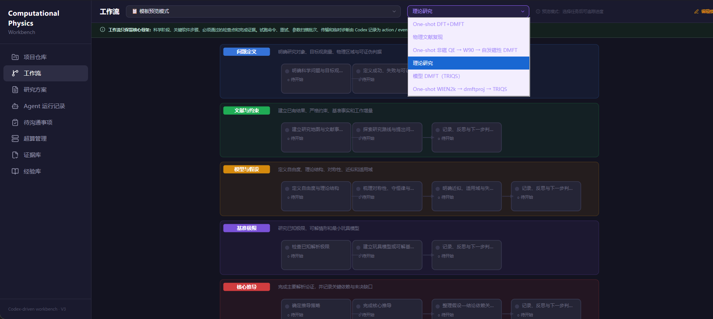
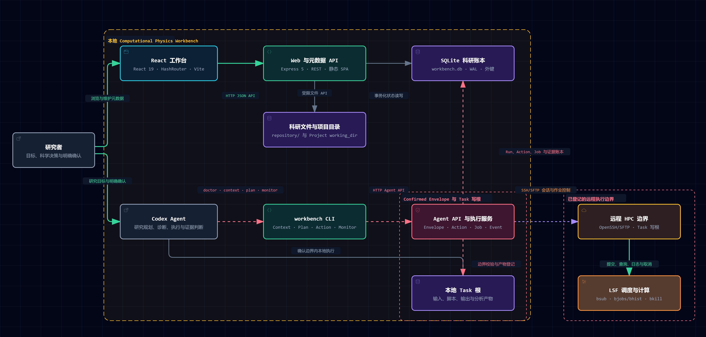
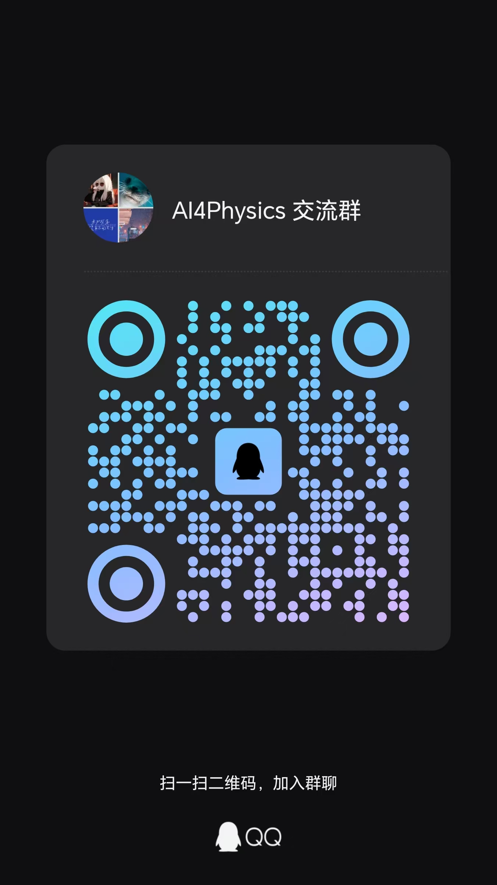

# Computational Physics Workbench

[](https://doi.org/10.5281/zenodo.22652970)

[English](README.en.md) | 简体中文

> An agent-operated, human-reviewed research workbench for computational and theoretical physics.

这是一个本地优先的科研协作系统：研究者通过对话提出问题、确认科学边界并审阅证据，Codex Agent 负责规划、执行、排错、远程作业监控和可追溯记录。

DFT+DMFT 是项目最早、目前最完整的应用场景，但不是能力边界。核心系统面向一般计算物理和理论物理研究，强调 Agent 自主执行、人类关键审阅、科研数据安全以及全过程可追溯。

它面向 AI for Science 与 scientific computing 场景，把可编辑科研工作流、HPC 作业、证据来源和人机协作边界放进同一套本地优先系统；适用于 DFT、DMFT、多体计算、数值模拟和理论推导等研究。

> **Project status:** This is an early research preview. Interfaces and data models may change. The project is looking for physicists, research-software engineers, HPC users, and agent-system researchers who want to shape the system with concrete workflows and evidence.

## 界面预览



工作流页面展示可选择、可编辑的计算与理论物理研究骨架；Web 用于审阅状态，实际研究执行由 Codex Agent 驱动。

## 当前支持范围

这个公开预览版提供一条完整的参考路径：

- Agent 客户端：Codex；
- 远程连接：OpenSSH/SFTP；
- HPC 调度器：IBM LSF。

Slurm、PBS、Claude Code、WorkBuddy 和 DeepSeek Harness 属于计划中的适配方向，当前尚未正式支持。Workbench 的 CLI、HTTP API、执行边界和科研账本按可移植核心设计，但客户端 Skill、Hook、长作业唤醒以及调度器命令仍需要对应 adapter。为了避免误提交，当前版本会明确拒绝非 LSF 调度器配置。

## Agent Skills

仓库在项目目录 [`skills/`](skills) 中提供三个互补 Skill，并将这里作为随源码和 GitHub 仓库分发的唯一版本。`AGENTS.md` 会把真实 Workbench 任务路由到对应的项目 Skill，不需要把 `workbench-agent` 复制到个人配置目录：

- [`workbench-agent`](skills/workbench-agent/SKILL.md)：真实研究任务的恢复、边界确认、执行、HPC 监控、证据与经验记录；
- [`literature-research`](skills/literature-research/SKILL.md)：系统文献调研、证据矩阵、最近邻工作与创新性审计；
- [`theory-derivation`](skills/theory-derivation/SKILL.md)：透明的理论推导以及符号、群论、算符和数值独立校验。

前者是 Workbench 执行协议；后两者是内置理论研究与物理文献复现工作流调用的科学能力。它们会先探测当前环境，不假设作者的本机路径或专有软件已经存在。

## 核心思想

传统科研软件通常要求人在图形界面或脚本之间手动组织任务。本项目把工作中心放在研究者与 Agent 的对话协作上：

- **研究者负责承诺和判断**：研究目标、物理假设、资源边界、关键关口和最终结论。
- **Agent 负责执行和闭环**：制定 Working Plan、调用本地或远程能力、监控作业、诊断失败、整理产物和证据。
- **Workbench 负责边界和记忆**：强制目录与权限范围，记录 Run、Action、Job、Artifact、Evidence 和可复用经验。
- **Web 界面负责审阅**：展示已经记录的研究状态，但不充当隐藏的 Agent 或远程执行入口。



完整关系见[交互式系统架构图](doc/computational-physics-workbench-architecture.html)。

## 主要功能

- 项目与计算任务管理
- One-shot DFT+DMFT、TRIQS 模型 DMFT、通用理论研究与物理文献复现工作流，以及交互式流程图
- 创建任务时复制模板；每个任务拥有可独立增删、修改的工作流
- 步骤进度、笔记、自定义命令与文件关联
- 工作流模板持久化、可视化编辑和重置；模板修改只影响之后创建的任务
- 项目工作目录浏览与文本文件查看
- 证据库：按项目/任务索引本地与远端产物、下载副本、处理图和 validator 结论
- 经验库：人工记录、Codex 候选经验与证据确认经验分层管理
- 超算管理：项目级 OpenSSH 连接、用户只读根、项目根、Task 写目录映射、传输记录和作业快照；不在 Web 执行
- Task Spec = 一次确认的 Confirmed Envelope + Codex 可自主修改的 Working Plan
- 理论研究每个阶段可追加任意多条“记录与反思”；重要新想法逐项处置，必要时停留或回到最早受影响阶段，未闭环时不能结束 Run
- Stage → Action → Job → Artifact/Evidence 追加式账本；Action spec 不可变但不逐动作授权
- Agent 运行记录与待沟通事项：Web 只读展示命令预览、作业监控、证据和决定，并支持项目/任务/状态筛选
- 材料无关 capability：Codex 自主选择脚本、输入和资源；Workbench 校验边界、快照、路径、哈希和资源
- 长作业由当前 Codex 任务的 heartbeat Scheduled Task 唤醒；Workbench 保存下次检查，Stop Hook 只负责防止失联
- 自动重试保留 retry lineage，并硬性受 Task Spec 重试预算约束

## 技术栈

- React 19 + TypeScript + Vite 8 + Tailwind CSS v4
- Node.js + Express 5
- SQLite（better-sqlite3）

## 本地运行

```powershell
npm install
npm run dev:full
```

开发模式下，请打开 Vite 在终端显示的地址（默认 `http://127.0.0.1:5173`）；前端会把 `/api` 请求代理到 `http://127.0.0.1:3001`。

生产式本地运行：

```powershell
npm run build
npm start
```

然后访问 <http://127.0.0.1:3001>。服务默认只监听回环地址。当前默认 CORS 白名单只包含本地开发页的 `5173` 来源；若生产页出现 `Origin is not allowed by Workbench`，请按[远程计算与连接指南](docs/REMOTE_COMPUTE.md#origin-is-not-allowed-by-workbench)配置完整来源，或暂用开发模式。

## 第一次使用

- [第一次使用：从项目到受控 Research Run](docs/GETTING_STARTED.md)：从 Codex 打开项目、创建 Workbench Project/Task、绑定工作流、撰写 Research Plan，到审阅并确认 Envelope。
- [使用指南：规划层、执行账本与长时间研究技巧](docs/USAGE_GUIDE.md)：解释 Action、边界、里程碑和时间线，介绍 AI 辅助工作流设计与 Codex Goal mode。
- [远程计算设备：连接、传输与 Agent 协作](docs/REMOTE_COMPUTE.md)：优先让 Agent 配置 OpenSSH/LSF、Task 远程边界、文件传输与监控，并区分 Web 限制、CORS 和真正的授权错误。

教程也说明了 Codex 对话与 Git 仓库的关系：完整对话默认不会进入仓库；Workbench 只保存必要的摘要、哈希、时间和可选对话引用。

## Agent CLI

Agent 本体是本项目中的 Codex 对话。研究者先在对话中确认研究方案、工作流、科学边界、资源和完成证据；Codex 再通过 `workbench` CLI 操作同一套 HTTP API，不直接读取 SQLite。Web 的“Agent 运行记录”和“待沟通事项”只显示已经记录的状态，不能启动、批准、提交、取消或对账：

```powershell
npm link                 # 可选：注册本地 workbench 命令
workbench doctor
workbench context --task <task-id> --allow-blocked --pretty
workbench plan show --plan <research-plan-id>
workbench workflow show --task <task-id>
workbench run draft --task <task-id> --plan <research-plan-id> --task-spec-file <json> --idempotency-key <key>
workbench run confirm --run <run-id> --summary <confirmed-summary> --conversation-ref <ref>
workbench execution contract --pretty
workbench action prepare --run <run-id> --stage <stage-id> --capability local.process --spec-file <spec.json> --idempotency-key <key>
workbench action execute --action <action-id>
workbench reflection record --run <run-id> --stage <stage-id> --file <reflection.json> --idempotency-key <key>
workbench monitor guard
workbench monitor attach --run <run-id> --automation-ref <ref> --cadence-minutes 10
workbench monitor tick --run <run-id>
workbench experience search --task <task-id> --query <关键词>
workbench experience capture --run <run-id> --stage <stage-id> --title <标题> --content-file <经验.md> --applicable-scope <范围> --idempotency-key <key>
```

CLI 默认连接 `http://127.0.0.1:3001`，可通过 `WORKBENCH_URL` 指向另一个本地端口。输出默认为 JSON；`--pretty` 仅改变排版。退出码 `2/3/4/5` 分别表示命令用法错误、API 拒绝、记录边界/待处理状态阻塞、服务不可达。

Task Spec 保存在 Workbench 账本中。研究方案与核心 Workflow 仍可纠错；改变 Confirmed Envelope 时才需要新的研究者确认。每个 Task 同时最多有一个开放 Run。

保存远程连接元数据不会自动获得执行授权。项目连接、Task 目录映射和一次确认的 Task Spec 必须一致，Workbench 才会调用系统 OpenSSH/LSF。用户根只读，只有当前 Task 写根允许上传和作业操作；执行器不按材料名、Task ID、Workflow step 或软件栈选择路线。Codex 根据研究方案生成通用 Action spec，Workbench 只负责建立不可变快照并强制边界。响应不确定时只按已记录身份对账；长作业通过当前 Codex 任务的 Scheduled Task 恢复，不在 Web 或 Express 内另建 Agent。Workbench 不保存密码或私钥，也不自动接受 host key。真实科学作业仍需先确认 Task Spec；配置步骤见[远程计算与连接指南](docs/REMOTE_COMPUTE.md)，复现边界见 [TESTING.md](TESTING.md)。

## 模板与任务工作流

工作流模板用于定义新任务的核心科学/软件骨架：关键阶段、不可缺少的软件转换、检查点和完成证据。试跑、重试、传输、参数扫描批次与临时诊断由 Codex 记录为 action/event，不为每个执行细节增加工作流节点。创建任务后，系统会把模板复制到任务中：

- 在“工作流”的模板预览模式中编辑模板，只影响以后创建的任务。
- 进入任务详情，点击“编辑任务流程”，可以为当前任务增加、删除或修改阶段和步骤。
- 在“工作流”页面选择具体任务后，“编辑任务流程”同样只修改该任务。
- 删除任务工作流中的节点不会删除已有计算目录、文件和历史进度。

从旧版本升级时，已有任务会以升级时当前显示的模板内容建立自己的初始副本，之后不再随模板变化。

## 常用检查

```powershell
npm test
npm run lint
npm run typecheck
npm run build
npm run test:e2e
```

## 数据说明

`data/` 中的 SQLite 数据库以及 `repository/` 中的真实科研输入输出不会提交到 Git。它们属于本地用户数据，应单独备份和管理。

项目协作与安全约定见 [AGENTS.md](AGENTS.md)，历史进度见 [progress.md](progress.md)。任务行为、架构变化和设计决定见 [docs/TASKS.md](docs/TASKS.md)、[docs/ARCHITECTURE.md](docs/ARCHITECTURE.md) 和 [docs/DECISIONS.md](docs/DECISIONS.md)；接口、数据字典和完整架构图见 [doc/](doc/)。

## 交流社区

我们建立了 **AI4Physics 交流群（QQ）**，欢迎对 AI for Science、计算物理、理论物理、科研 Agent、HPC 工作流或开源贡献感兴趣的朋友加入交流。

<p align="center">
  
</p>

交流群不是正式技术支持渠道。请不要在群内发送密码、私钥、完整 HPC 登录信息或尚未公开的科研数据；可复现的软件问题和功能建议仍推荐提交 GitHub Issue。

## 参与贡献

项目尤其欢迎以下贡献：

- 新的计算物理或理论物理研究工作流；
- 可复现性、证据评价和不确定度表达；
- HPC 调度器、科研软件栈和数据传输能力；
- Agent 安全边界、长任务恢复和失败诊断；
- 安装体验、文档、测试和科研软件工程。

开始前请阅读 [CONTRIBUTING.md](CONTRIBUTING.md)。这是一个志愿维护的早期项目，不承诺固定响应时间；小而完整、带验证证据的贡献最容易被审阅。

近期优先方向见[未来路线图](ROADMAP.md)：可靠长任务、科学主张与经验记忆、调度器/Agent adapter、卡片式工作流，以及更强的理论与多体物理能力。

## 安全与隐私

不要在 Issue、日志或测试夹具中提交真实密钥、HPC 地址、用户名、私钥、未公开科研数据或本地数据库。安全漏洞请按照 [SECURITY.md](SECURITY.md) 私下报告。

## 如何引用

如果这个软件参与了研究规划、计算执行、证据整理或结果复现，请同时引用：

1. 这个软件及所使用的具体版本；
2. 研究中实际使用的物理方法、求解器和上游科学软件；
3. 使用该工具得到的物理成果论文（如果已经发表）。

软件引用元数据见 [CITATION.cff](CITATION.cff)。GitHub 会据此生成 APA 和 BibTeX 引用。请使用 `v0.2.0` 的[版本 DOI](https://doi.org/10.5281/zenodo.22653039) 精确引用本次发布；[概念 DOI](https://doi.org/10.5281/zenodo.22652970) 会始终指向本项目的版本集合。

当前建议引用为：

> Yan, Shuai. (2026). Computational Physics Workbench (Version 0.2.0) [Computer software]. Zenodo. https://doi.org/10.5281/zenodo.22653039

## 许可证

本项目采用 [Apache License 2.0](LICENSE)。提交贡献即表示你同意按照该许可证提供相应贡献，除非你明确书面声明其他安排。
