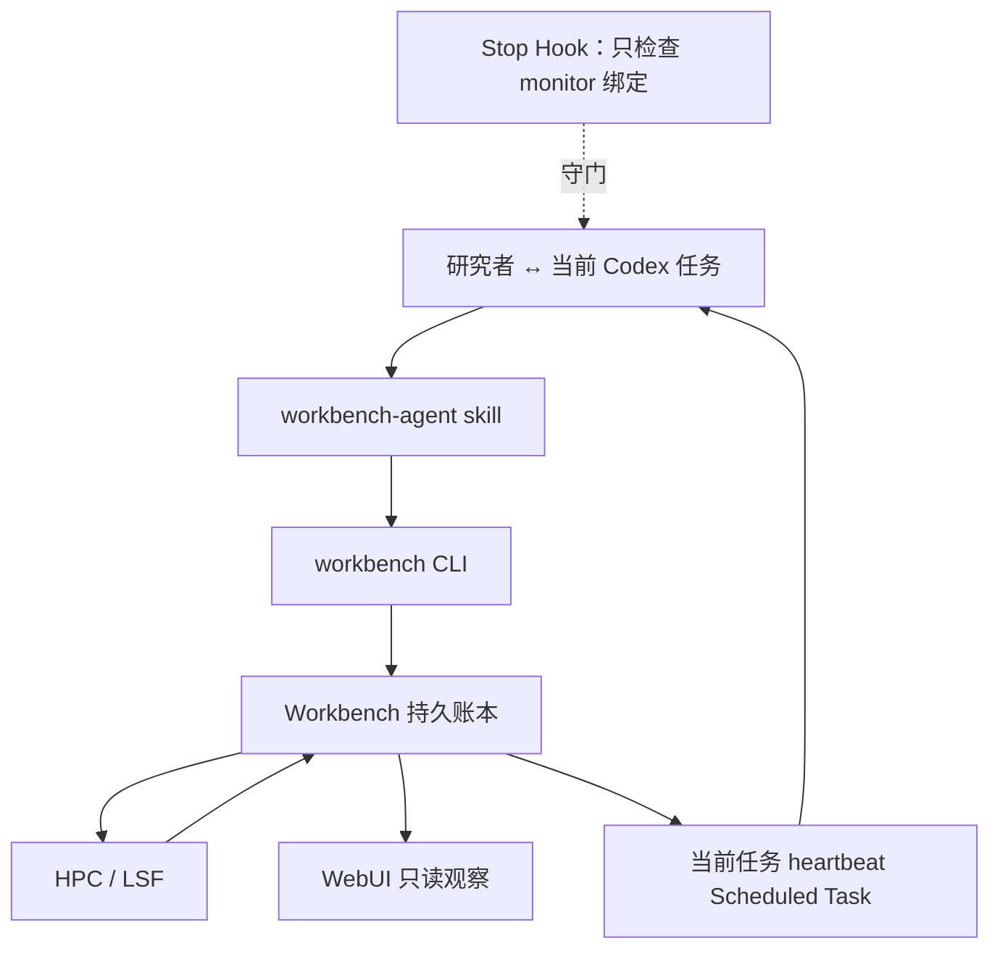

# Workbench V3 架构图

## 产品边界

```text
┌─────────────────────────────────────────────────────────┐
│  Codex 项目对话                                         │
│  研究沟通 · Research Plan · Task Spec · 自主执行/纠错    │
└──────────────────────────┬──────────────────────────────┘
                           │ workbench-agent + CLI
                           ▼
┌─────────────────────────────────────────────────────────┐
│ Express API                                              │
│ Run/Task Spec │ Action │ Pending │ Artifact │ Experience │
└───────────────┬───────────────┬─────────────────────────┘
                │               │ bounded capability
                ▼               ▼
        ┌──────────────┐  ┌───────────────────────────────┐
        │ SQLite v5    │  │ local process / SSH/SFTP/LSF │
        │ audit ledger │  │ scheduler + remote files     │
        └──────┬───────┘  └───────────────────────────────┘
               │ read observation
               ▼
┌─────────────────────────────────────────────────────────┐
│ WebUI                                                    │
│ 项目 · 工作流 · 方案 · Agent记录 · 待沟通 · 超算 · 证据 │
│ Web 不启动/确认/提交/取消/对账                           │
└─────────────────────────────────────────────────────────┘
```

## 研究对象关系

```text
Project
├─ working_dir
├─ HPC profiles + Task bindings
└─ Task
   ├─ stable task_root_rel
   ├─ independent workflow_snapshot
   ├─ Research Plan
   └─ Research Run
      ├─ Confirmed Envelope (researcher confirms once)
      ├─ Working Plan (Codex edits autonomously)
      ├─ run_events
      ├─ pending_items
      └─ Workflow Stage
         └─ Action
            ├─ Remote Job 0..n
            ├─ Artifact 0..n
            └─ Evidence Check 0..n
```

## 纠错闭环

```text
发现错误/缺漏
      │
      ▼
记录 fact + inference，计算影响范围
      │
      ├─ Envelope 内 ─→ 修订 Plan/Workflow/Working Plan
      │                  标记 Artifact validity
      │                  最小重算并恢复
      │
      └─ Envelope 外 ─→ researcher Pending Item
                         Codex 对话确认差异
                         Envelope revision + 恢复
```

## 远程目录边界

```text
remote userRoot                 read-only through Workbench
└─ projectRoot                  existing project directory
   └─ taskRootRel               current Task read/write root
      └─ arbitrary Codex tree   inputs/jobs/checks/analysis/...
```

HPC profile 固定 alias、userRoot 和 projectRoot；Task binding 固定 `taskRootRel`。Action spec 不接受任意写根，服务从 binding 派生。

## LSF 提交恢复

```text
Action spec + input hashes
          ↓
insert remote_jobs(prepared, unique token/name)
          ↓
verify remote script/input hashes
          ↓
one bsub call
          ↓
post-submit bjobs sanity check
     ┌────┴─────────────┐
   confirmed       response uncertain
     │                  │
waiting_remote     submission_uncertain
     │                  │
status/logs        reconcile by unique name
     │                  │
terminal          never resubmit to probe
```

## 模块映射

```text
src/pages/*                      Web observation/metadata
src/api/client.ts                typed frontend client
server/routes/agent.ts           Agent HTTP contract
server/services/agentCore.ts     Run/Task Spec/Pending/Event
server/services/agentActions.ts  Action/Artifact/Evidence
server/services/actionExecutor.ts generic capability executor
server/services/hpcConfig.ts     connection + Task binding
server/services/remote.ts        OpenSSH/SFTP/LSF + reconcile
bin/workbench.js                 sole real-Agent machine entry
skills/workbench-agent/SKILL.md  Codex recovery/autonomy protocol
```
# 长作业执行与观察关系



Scheduled Task 负责跨回合唤醒同一 Codex 任务；Workbench 保存事实和下次检查；Stop Hook 不执行远程命令；WebUI 不成为 Agent。
