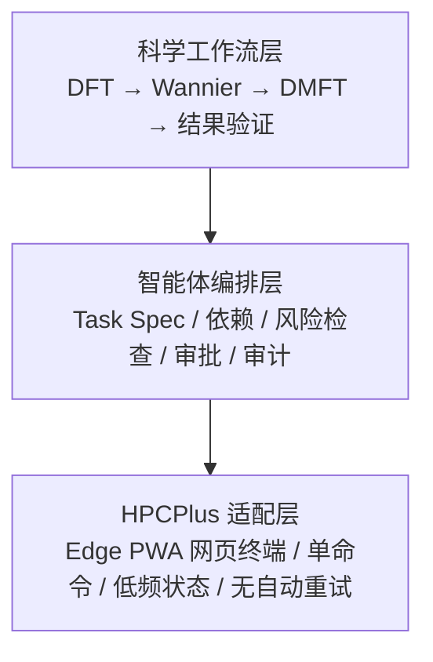

# DFT+DMFT Workbench 架构图

> 最后更新：2026-07-19

## 目标三层架构



- 科学工作流层定义步骤、输入输出和需要研究者判断的物理判据，不自动猜测或修改科学参数。
- 编排层把每次候选动作固化为 Task Spec；审批绑定完整内容哈希，任何实质修改都会使旧审批失效。
- 对 `bsub < file.lsf`，哈希和风险检查同时覆盖完整 LSF 脚本快照；审批者必须确认远端文件与快照一致。
- 适配层只把一条已经审查的命令中继到用户已登录的网页终端，不登录门户、不调用门户接口、不传输文件。

## 整体分层架构

```
┌─────────────────────────────────────────────────────────────────┐
│                        浏览器 (Browser)                          │
│  ┌───────────────────────────────────────────────────────────┐  │
│ │  React SPA (HashRouter)                                    │  │
│ │  ┌──────────┐  ┌──────────┐  ┌──────────┐  ┌──────────┐   │  │
│ │  │项目仓库   │  │工作流     │  │经验库     │  │项目详情   │   │  │
│ │  │ProjectsPg│  │WorkflowPg│  │Experience│  │DetailPage│   │  │
│ │  └────┬─────┘  └────┬─────┘  └────┬─────┘  └────┬─────┘   │  │
│ │       │             │            │             │          │  │
│ │  ┌────┴─────────────┴────────────┴─────────────┴────┐     │  │
│ │  │           API Client (src/api/client.ts)          │     │  │
│ │  │  fetch wrapper → 封装所有 HTTP 请求               │     │  │
│ │  └───────────────────────┬───────────────────────────┘     │  │
│ └───────────────────────────┼───────────────────────────────┘  │
└──────────────────────────────┼──────────────────────────────────┘
                               │ HTTP (fetch /api/*)
                               ▼
┌─────────────────────────────────────────────────────────────────┐
│                    Express Server (localhost:3001)               │
│  ┌───────────────────────────────────────────────────────────┐  │
│  │                    中间件层 (Middleware)                    │  │
│  │  cors → express.json → 路由分发 → static(dist/) → SPA fallback│
│  └───────────────────────────┬───────────────────────────────┘  │
│                              │                                   │
│  ┌───────────────────────────▼───────────────────────────────┐  │
│  │              Controller 层 (server/routes/*.ts)            │  │
│  │  接收 HTTP 请求，解析参数，调用 Service 逻辑，返回 JSON     │  │
│  │                                                            │  │
│  │  ┌─────────────┐ ┌──────────┐ ┌──────────┐ ┌──────────┐  │  │
│  │  │projects.ts  │ │tasks.ts  │ │progress  │ │files.ts   │  │  │
│  │  │             │ │          │ │  .ts     │ │           │  │  │
│  │  └──────┬──────┘ └────┬─────┘ └────┬─────┘ └─────┬─────┘  │  │
│  │  ┌──────────┐  ┌──────────┐  ┌─────────────┐           │  │  │
│  │  │experiences│  │workflows │  │taskSpecs.ts │           │  │  │
│  │  │  .ts     │  │  .ts     │  │审批/运行审计 │           │  │  │
│  │  └────┬─────┘  └────┬─────┘  └──────┬──────┘           │  │  │
│  └───────┼─────────────┼──────────────────────────────────┘  │
│          │             │                                        │
│  ┌───────▼─────────────▼──────────────────────────────────┐    │
│  │           Service + DAO 层 (当前合并于 routes 中)        │    │
│  │  业务逻辑 + 数据访问（当前直接调用 db.prepare SQL）       │    │
│  │  ┌─────────────────────────────────────────────────┐    │    │
│  │  │  db.ts (better-sqlite3 实例)                     │    │    │
│  │  │  → Schema 初始化                                 │    │    │
│  │  │  → WAL 模式 + 外键约束                           │    │    │
│  │  └──────────────────────┬──────────────────────────┘    │    │
│  └─────────────────────────┼──────────────────────────────┘    │
│                             │                                    │
│  ┌──────────────────────────▼──────────────────────────────┐    │
│  │              数据存储层 (Data Layer)                      │    │
│  │  ┌──────────────┐  ┌────────────────────────────────┐  │    │
│  │  │ SQLite       │  │ 文件系统 (项目 working_dir)       │  │    │
│  │  │ workbench.db │  │ → 浏览/读取/创建目录               │  │    │
│  │  └──────────────┘  └────────────────────────────────┘  │    │
│  └─────────────────────────────────────────────────────────┘    │
└──────────────────────────────────────────────────────────────────┘
```

## 前端组件架构

```
src/
├── main.tsx                      # 入口，挂载 React
├── App.tsx                       # 路由配置 (HashRouter)
├── index.css                     # Tailwind CSS v4
│
├── api/
│   └── client.ts                 # API 调用封装层
│       ├── projectsApi           #   .list() .get() .create() .update() .delete()
│       ├── tasksApi              #   .list() .get() .create() .update() .delete()
│       ├── progressApi           #   .list() .upsert()
│       ├── taskSpecsApi          #   .create() .check() .approve() .startRun() .verify()
│       ├── stepFilesApi          #   .list() .add() .remove()
│       ├── filesApi              #   .browse() .mkdir() .read()
│       ├── experiencesApi        #   .list() .create() .update() .delete()
│       └── workflowsApi          #   .list()
│
├── data/
│   └── workflows.ts              # 工作流模板注册表（静态数据）
│       ├── WORKFLOWS[]           #   工作流模板数组
│       └── 辅助函数               #   getWorkflow / getStages / getSteps / ...
│
├── types/
│   └── index.ts                  # 全部 TypeScript 类型定义
│
├── pages/                        # 页面组件
│   ├── ProjectsPage.tsx          # 项目仓库列表
│   ├── ProjectDetailPage.tsx     # 项目详情（任务列表 + 文件仓库 Tab）
│   ├── TaskWorkflowPage.tsx      # 任务工作流（绑定 taskId，含进度追踪）
│   ├── WorkflowPage.tsx          # 工作流入口（模板预览 + 任务选择模式）
│   └── ExperiencePage.tsx        # 经验库（后端持久化）
│
└── components/                   # 可复用组件
    ├── Sidebar.tsx              # 侧边栏导航（项目仓库/工作流/经验库）
    ├── Flowchart.tsx            # SVG 交互式流程图
    ├── StepDetail.tsx           # 步骤详情面板（状态/笔记/文件关联）
    ├── ProgressBar.tsx          # 进度条（总体 + 各阶段）
    ├── TaskSpecPanel.tsx        # 计划检查、审批、执行证据和人工验证
    └── FileBrowser.tsx          # 文件浏览器（目录导航/文件查看）
```

## 后端路由挂载关系

```
Express App (index.ts)
│
├── /api/workflows                    → workflows.ts
│
├── /api/projects                     → projects.ts
│   ├── GET    /                       列出所有项目
│   ├── POST   /                       创建项目
│   ├── GET    /:id                    获取单个项目（含 task_count）
│   ├── PUT    /:id                    更新项目
│   └── DELETE /:id                    删除项目（级联）
│
├── /api/projects/:projectId/tasks    → tasks.ts (mergeParams)
│   ├── GET    /                       列出项目下任务
│   └── POST   /                       创建任务
│
├── /api/tasks                        → tasks.ts
│   ├── GET    /:taskId                获取任务（含进度）
│   ├── PUT    /:taskId                更新任务
│   └── DELETE /:taskId                删除任务（级联）
│
├── /api/tasks/:taskId/progress       → progress.ts (mergeParams)
│   ├── GET    /                       获取所有步骤进度
│   ├── PUT    /:stepId                更新步骤状态/笔记
│   ├── GET    /:stepId/files          列出步骤关联文件
│   └── POST   /:stepId/files          添加文件关联
│
├── /api/tasks/:taskId/task-specs     → taskSpecs.ts (mergeParams)
│   ├── GET    /                       列出任务的执行计划
│   └── POST   /                       创建草稿计划
│
├── /api/task-specs                   → taskSpecs.ts
│   ├── PUT    /:specId                编辑并使旧审批失效
│   ├── POST   /:specId/check          检查依赖、风险并计算内容哈希
│   ├── POST   /:specId/approvals      写入不可变审批事件
│   ├── POST   /:specId/runs           为 ready 计划开启一次执行审计
│   ├── PUT    /runs/:runId            写入完成、失败或未知结果
│   └── POST   /:specId/verify         人工验证执行证据
│
├── /api/step-files/:fileId            → index.ts 内联
│   └── DELETE                          删除文件关联
│
├── /api/projects/:projectId/files     → files.ts (mergeParams)
│   ├── GET    /?path=                  浏览项目工作目录
│   ├── POST   /mkdir                   创建子目录
│   └── GET    /read?path=              读取文件内容
│
├── /api/experiences                  → experiences.ts
│   ├── GET    /                       列出经验（支持搜索/过滤）
│   ├── POST   /                       创建经验
│   ├── GET    /:id                    获取单条
│   ├── PUT    /:id                    更新
│   └── DELETE /:id                    删除
│
├── express.static(dist/)             # 静态前端文件
└── SPA fallback middleware           # 非 API 路由返回 index.html
```

## 数据流向（典型场景）

### 场景：用户在流程图上点击步骤 → 标记为已完成

```
用户点击步骤节点
  │
  ▼
Flowchart.tsx  → onSelectStep(step) 回调
  │
  ▼
WorkflowPage / TaskWorkflowPage  → 渲染 StepDetail 组件
  │
  ▼ 用户点击"已完成"按钮
  │
StepDetail.tsx  → progressApi.upsert(taskId, stepId, { status: 'completed' })
  │
  ▼
api/client.ts  → fetch PUT /api/tasks/:taskId/progress/:stepId
  │
  ▼ HTTP
  │
server/routes/progress.ts  → db.prepare('INSERT OR UPDATE step_progress ...')
  │
  ▼
SQLite (workbench.db)  → step_progress 表更新
  │
  ▼ 返回更新后的 StepProgress JSON
  │
StepDetail.tsx  → onProgressChanged() 回调
  │
  ▼
WorkflowPage / TaskWorkflowPage  → load() 重新拉取进度
  │
  ▼
Flowchart.tsx  → 重新渲染，步骤节点变绿色
```

## Task Spec 与 HPCPlus 网页终端通道

```text
科学步骤 / 模板命令
  -> Task Spec（目录、命令、依赖、输出、判据、超时）
  -> 风险检查 + 内容哈希 + 必要时人工审批
  -> command run 审计记录
  -> 项目内 hpcplus-web-terminal skill（单命令封装）
  -> Windows UI Automation（精确定位 Edge PWA 的 xterm）
  -> HPCPlus 网页终端
  -> 登录节点 shell / LSF
  -> LSF job ID / monitoring
  -> ≥60 秒状态查询 + 1–200 行有界日志
  -> completed / failed / unknown
  -> 人工科学验证（只有验证通过才是 Task Spec completed）
  -> 人工经验沉淀（保留来源 Task Spec）
```

前端不直接操作网页终端。工作台 API 负责计划、审批和审计；本地 skill 执行器在命令发送前重新读取 `ready` 计划并创建 run。它不使用 SSH/SCP，不访问门户接口，不上传下载文件，也不遍历门户页面。每次执行（包括调度查询）都由独立参数携带并核验 Task Spec 已审批目录，用户命令只允许该目录内的相对路径。只有同一次执行中按顺序出现的开始/结束标记对才能确认远端退出码；终端超时、任一标记缺失、403、断线、会话过期或发送后 UIA 异常一律进入 `unknown`，由研究者检查调度器和日志后显式决定下一步。

LSF 提交只有在输出中识别到 `Job <id> is submitted` 才进入 `monitoring`。服务端生成固定 `bjobs` 状态命令并在远端调用前预留 60 秒轮询窗口；日志读取只能接受任务目录内无通配符/穿越的相对路径，行数上限 200，并有独立 60 秒窗口。两类操作都有不可变事件记录且不自动重试。

若服务在执行、轮询或日志读取期间退出，重启时不把遗留 `executing` 当作可重试任务。启动恢复事务将命令运行和轮询连同关联 Task Spec 标记为 `unknown`，日志读取只结束该读取事件，并写入明确的“服务重启、未自动重试”原因；第二次运行恢复事务不会再次修改这些记录。

经验库不自动概括科学结论。研究者只能从已完成、失败、阻塞或 unknown 的 Task Spec 显式填写经验内容；服务端由来源计划推导并固定关联项目、任务和步骤，UI 同时显示来源 Task Spec ID。

## 当前架构特点

### 现状
- **Controller-DAO 两层合并**：routes 文件同时承担路由解析（Controller）+ 业务逻辑（Service）+ 数据访问（DAO），直接调用 `db.prepare()` 执行 SQL
- 适合当前项目规模（6 个路由文件、5 张表），开发速度快

### 未来可演进方向
如果项目复杂度增长，可拆分为三层：

```
routes/*.ts        (Controller)   → 只负责 HTTP 解析和响应
services/*.ts      (Service)      → 业务逻辑、数据校验、跨表事务
repositories/*.ts  (DAO)          → 纯 SQL 操作，每张表一个 Repository
```
