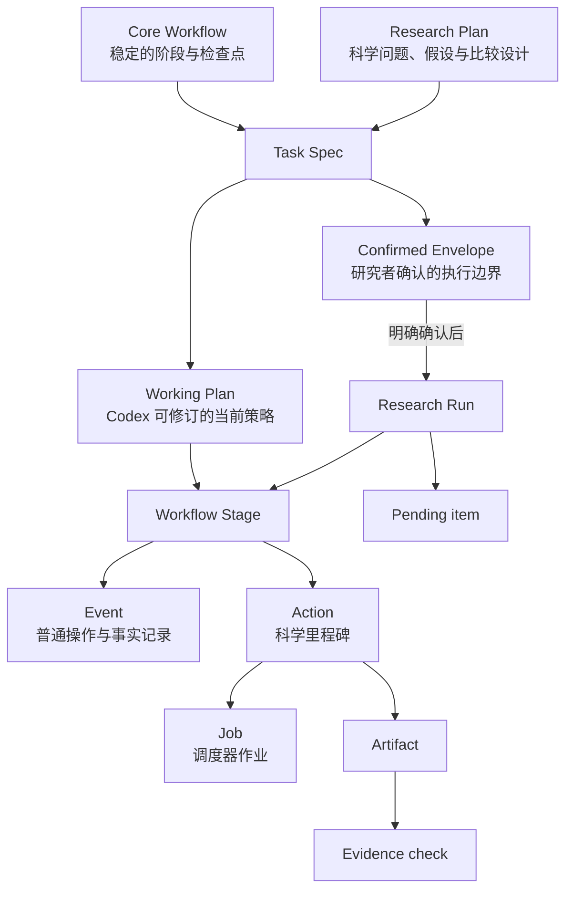

# 使用指南：规划层、执行账本与长时间研究技巧

这份指南解释 Workbench 的核心概念、怎样让 AI 辅助设计新工作流，以及怎样使用 Codex Goal mode 推进长时间研究。第一次使用请先完成[从项目到受控 Research Run](GETTING_STARTED.md)。

## 一张图理解整体关系



图中的箭头表示约束、归属或来源，不表示每次 Run 都必须创建 Job。纯理论推导或本地分析可以只有本地操作、Action 和 Evidence。

## 三个规划层不要混在一起

### Research Plan：科学上为什么做

Research Plan 保存问题、背景、假设、方法比较、参数与不确定度设计、预期证据和解释口径。它可以随新证据持续修订。

把材料参数、U/J、窗口、网格、收敛阈值、对照矩阵和候选机制写在这里，而不是硬编码进通用执行器。

### Core Workflow：任何一次该类研究都不能缺的骨架

Workflow 只保留稳定的科学阶段、软件转换、关键检查点和完成证据。它回答“这类任务至少要经过哪些关口”，不描述每一次具体尝试。

适合成为节点：

- 建模、数据准备、求解、验证、解释等必要阶段；
- 会影响物理可信度的检查点；
- 跨软件栈的关键转换；
- 最终验收所需的证据步骤。

不适合成为节点：

- SSH 连接、上传下载、建目录和队列轮询；
- 每条 shell 命令或临时诊断；
- 一次失败后的普通排错；
- 每个扫描点、每个重试或每个调度器 Job。

### Task Spec：这一次 Run 能做什么

Task Spec 由两部分组成：

- **Confirmed Envelope**：需要研究者确认的稳定边界；
- **Working Plan**：Codex 在该边界内可持续修改的当前战术。

目录布局、下一批 Actions、诊断方法和边界内的重试属于 Working Plan。科学目标、允许的方法/软件、能力、资源、保护路径、完成证据和研究者关口属于 Envelope。

判断是否需要重新确认的简单问题是：这次变化有没有扩大或改变研究者承诺的“盒子”？如果只是盒子内换顺序、改目录或修正诊断，不需要重新确认；如果改变方法、软件、资源、权限、保护路径、完成证据或关键科学口径，需要新的 researcher pending item 和 Envelope revision。

## Action、里程碑和执行时间线是什么关系

**Action 是里程碑的机器记录形式。** “里程碑”描述科学意义，Action 提供不可变规格、哈希、状态和来源链。

| 概念 | 作用 | 典型例子 |
| --- | --- | --- |
| Stage / Step | Workflow 中的稳定骨架 | 构造模型、求解、验证、自能检查、物理解读 |
| Event | 按顺序追加到执行时间线的事实、推断或决定 | 连接成功、命令完成、文件传输、阶段反思、边界确认 |
| Action | 值得长期追踪的科学工作单元/里程碑 | 正式提交、参数扫描批次、替代科学计算、证据验证 |
| Job | Action 触发或关联的调度器实例 | 一个 LSF job；一个 Action 可有零个、一个或多个 Job |
| Artifact | Action 产生或登记的输出 | 输入快照、结果文件、图、推导稿 |
| Evidence check | 对 Artifact 或结果的验证判断 | 哈希核对、收敛检查、因果性检查、独立推导复核 |
| Pending item | 尚待处理的问题 | Codex 自己排错，或研究者决定是否扩边界 |
| Timeline | Run 内所有 Event 的有序审计记录 | 从 draft、确认、普通操作到结果和决定的全过程 |

几个实用判断：

- “运行了一个命令”通常只是 Event，不自动等于 Action；
- “完成了一个会影响结论且需要保留来源的计算批次”适合成为 Action；
- Action 不是逐命令许可单。Envelope 确认后，边界内的普通操作不需要逐项审批；
- 连接、认证、超时、建目录和传输失败是操作事件，不消耗科学自动重试额度；
- 替换失败的科学计算必须创建带 `retry_of` 的新 Action，不能覆盖旧记录或无来源重提；
- 时间线是发生过什么，Workflow 是本应经过什么，两者不要互相替代。

## 用 AI 辅助设计新工作流

当前预览版的 Web 编辑器可以修改已有模板或某个 Task 的独立工作流，但还没有“新建空白模板”按钮。推荐先做 Task 级试验，验证后再加入源码成为新的内置模板。

### 路径 A：只为当前 Task 试验

1. 选择最接近的现有模板创建 Task；
2. 把研究目标、方法、必要检查和失败判据告诉 Codex；
3. 让 Codex先给出“保留/删除/新增节点”的提案，不直接修改；
4. 在 Task 详情中打开 **编辑任务流程**，按审阅后的提案调整；
5. 检查每个节点是否真的是稳定骨架，而不是本次执行细节；
6. 在尚未创建 Run 前用这个 Task 做一次演练；需要放弃时可删除，产生 Run 历史后则应归档。

这条路径不会改变全局模板或其他 Task，最适合低成本验证。

### 路径 B：贡献新的内置模板

当 Task 级流程已被真实任务验证后，让 Codex：

1. 把稳定部分抽象为材料无关、参数无关的阶段和步骤；
2. 在 `src/data/workflows.ts` 中增加唯一 ID 的内置模板；
3. 把模板加入公开 `WORKFLOWS` 注册表；
4. 增加结构、ID 唯一性、迁移或最小烟雾测试；
5. 更新 README/教程并说明适用范围和未验证边界；
6. 运行 `npm test`、`npm run lint` 和 `npm run build` 后再提交。

不要直接改本地 SQLite 来“创建模板”。源码内置模板才会随 Git 仓库分发；数据库只是运行时副本和用户编辑结果。

### 可以直接复制给 Codex 的工作流设计提示

```text
请为以下计算/理论物理任务设计一个 Workbench 核心工作流：<研究目标>。

先不要改代码。请阅读现有 Workflow 类型和最接近的模板，然后输出：
1. 适用范围与不适用范围；
2. 必不可少的 stages，以及每个 stage 的完成条件；
3. 每个 stage 下的核心 steps、输入、输出和关键检查；
4. 哪些内容应放 Research Plan，哪些应放 Working Plan 或 Event/Action；
5. 可能导致错误结论的缺失检查；
6. 与现有模板相比为什么必须新建，而不是只修改一个 Task 快照。

约束：不要把 SSH、传输、排队、临时诊断、每个扫描点或每次重试做成节点；
不要硬编码材料名、Task ID、本机路径或未经说明的物理参数。
```

### 工作流通过审阅的最低标准

- 任何节点都能说明它对科学结论或软件转换为什么不可缺；
- 同一模板可用于多个材料、模型或具体参数；
- 参数和可争议假设留在 Research Plan；
- 完成条件包含科学证据，不只是文件存在或进程退出码为零；
- 失败、重试、传输和监控不会膨胀为大量节点；
- 名称、ID、顺序和输入输出没有歧义；
- 至少经过一个不污染正式数据库与科研目录的验证，最好再经过一个真实小任务。

## 用 Codex Goal mode 提升长时间研究能力

在 Codex 桌面应用、交互式 CLI 或 IDE 对话中输入 `/goal` 可以启动 Goal mode。目标文本同时是第一条提示和完成判据；运行时可以继续发送消息补充上下文，也可以暂停、恢复、编辑或清除目标。每个对话拥有自己的上下文和目标，Goal 不会扩大原有文件、网络、sandbox 或审批权限。官方说明见 [Long-running work](https://learn.chatgpt.com/docs/long-running-work)。

一个适合 Workbench 的 Goal 应包含三部分：

- **Outcome**：要交付的科学结果或明确的受阻状态；
- **Constraints**：必须遵守的 Envelope、技能、数据边界和禁止事项；
- **Verification**：怎样证明进展或完成。

示例：

```text
/goal
推进 Workbench Task <task-id> 的当前 Research Run，直到：
（a）在已确认 Envelope 内得到满足完成证据的结果；或
（b）出现确实需要研究者决定、授权或扩边界的事项，并把差异和影响写清。

约束：遵守 AGENTS.md 和 skills/workbench-agent/SKILL.md；不直接读写 SQLite；
不绕过 Task 根和远程写边界；不重复提交 uncertain Job；不把部分结果、文件存在、
检查数量或程序退出当成科学问题已回答。

验证：每个重要结论有可定位的 Artifact/Evidence；替代计算保留 retry lineage；
所有非终态远程 Job 有 ACTIVE heartbeat；结束前 workbench monitor guard 通过。
```

### 三种“长时间机制”不要混淆

| 机制 | 负责什么 | 不负责什么 |
| --- | --- | --- |
| Codex Goal mode | 让当前对话围绕一个可验证终点持续推进 | 不扩大权限，不代替物理目标或证据标准 |
| Workbench `scientificGoal` | 在理论 Run 的 Envelope 中固定原始科学问题、成功标准与可接受答案 | 不负责唤醒 Codex 或轮询 HPC |
| 当前对话 heartbeat | 有非终态远程 Job 时按 `next_check_at` 唤醒 Codex 对账并继续 | 不是 Web/Express 后台 worker，也不应永久存在 |

只有记录到第一个非终态远程 Job 后才需要 heartbeat。每个 Run 只保留一个；所有 Job 终态且没有后续 Job 时，Codex 必须删除它并让 Workbench 记录关闭回执。

### Goal 使用技巧

- 先用 `/plan` 把模糊问题整理成可验证目标，再进入 `/goal`；
- 把“完成”写成证据条件，而不是“研究一下”或“尽量跑完”；
- 在同一对话中补充信息和调整约束，避免丢失当前 Run 上下文；
- 需要状态说明时让当前对话总结，或使用 side chat，避免无意中打断主目标；
- 断网或要关闭电脑前暂停 Goal，回来后先恢复 Workbench Context 再继续；
- 不让两个并行 Codex 对话同时写同一个 Task 根、同一个 Run 或同一远程目录；
- 独立的研究目标使用独立 Task 和对话，相关但只读的审阅可以另开对话；
- Goal 卡住时先看 `待沟通事项`：`audience=codex` 应由 Agent 排错，只有 `audience=researcher` 才需要你做实质决定。

## 常见误区

### “我已经创建 Task，为什么 Run 还没开始？”

Task 是研究容器；Run 需要 Codex 读取方案与工作流、草拟 Task Spec、展示精确 Envelope，并获得一次明确确认。Web 创建 Task 不等于授权执行。

### “Working Plan 变了，是不是每次都要重新确认？”

不需要。只要仍在 Confirmed Envelope 内，Codex 可以调整目录、顺序、诊断和下一批 Actions。改变科学承诺、方法/软件、资源、权限、保护路径、完成证据或研究者关口时才重新确认。

### “每次运行命令都要创建 Action 吗？”

不需要。普通本地/远程命令、连接、检查和传输进入 Event 时间线。正式提交、科学重试、批次和证据验证等需要持久来源的里程碑才创建 Action。

### “Codex 对话丢了，研究记录也丢了吗？”

不应当。完整聊天默认不在 Git，也不是恢复的唯一来源。新的对话应通过 `workbench doctor` 和 `workbench context --task <id> --allow-blocked --pretty` 恢复账本状态，再读取关联的 Research Plan 和必要 Task 文件。

### “Web 里没有提交/取消作业按钮，是不是没做完？”

这是执行边界的一部分。Web 只观察和管理普通元数据；提交、取消、确认和对账通过 Codex 对话及 `workbench` CLI 完成，防止出现第二条无记录的执行通道。

## 推荐的日常节奏

1. 在一个 Codex 对话中明确本轮结果；
2. 恢复紧凑 Context，只读当前状态；
3. 审阅或修订 Research Plan 与 Workflow；
4. 首次执行前确认精确 Envelope；
5. 让 Codex 在边界内自主工作；
6. 只在 researcher pending item 或结论审阅时介入；
7. 用 Web 查看里程碑、Job、Evidence 和时间线；
8. 结束时确认监控已关闭、证据可定位、结论没有超过证据；
9. 把真正可复用的经验沉淀为带适用边界的候选经验。

更底层的数据层级和状态机见 [任务、工作流与研究运行](TASKS.md) 与[架构说明](ARCHITECTURE.md)。
